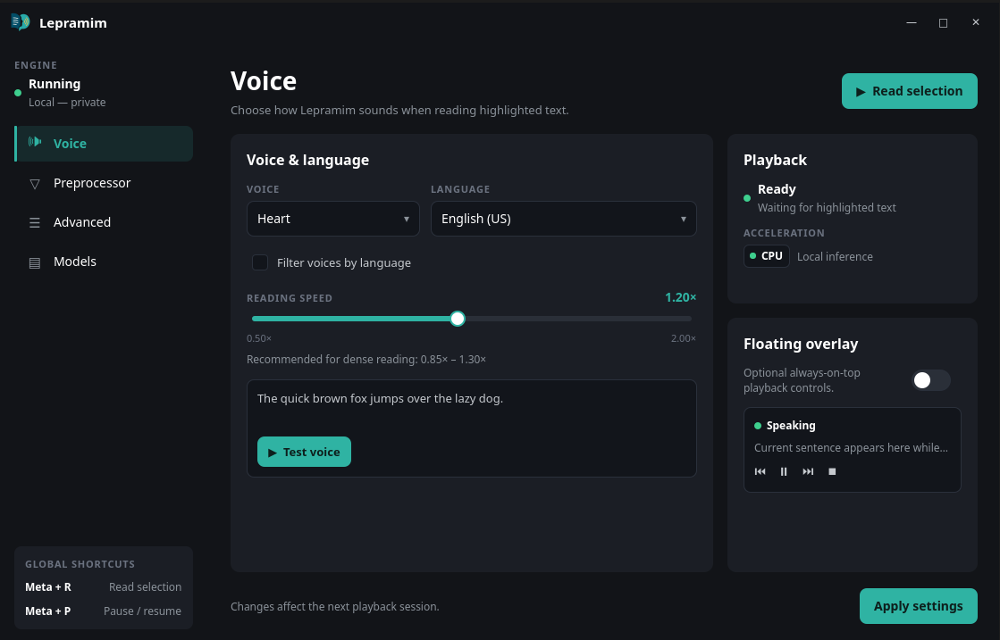

# Lepramim

Listen to anything you can highlight.

Lepramim is a local text-to-speech app for Linux. Select text anywhere — a PDF,
a web page, an editor — press **Meta+R**, and hear it read aloud with natural
neural voices. Everything runs on your machine: no accounts, no cloud, no
telemetry.

## Why Lepramim

- **One hotkey to listen.** Highlight text, press **Meta+R**. Press **Meta+P**
  to pause and resume.
- **Private by design.** Speech is generated locally on your hardware. Nothing
  is sent anywhere, and there is nothing to sign up for.
- **Built for real documents.** Text is cleaned up before speaking: citations
  like `[3]` and `(Smith, 2020)` are stripped, `i.e.` and `etc.` are expanded,
  math symbols and numbers are read as words, and Markdown formatting is
  removed. Academic PDFs and math-heavy pages come out listenable.
- **54 voices, 9 languages.** American and British English, Spanish, French,
  Hindi, Italian, Japanese, Brazilian Portuguese, and Mandarin Chinese — with a
  speed slider from 0.50× to 2.00×.
- **One-file install.** A single AppImage. Speech models (~340 MB) download
  automatically on first launch, once, and are verified by checksum.
- **Lives in your tray.** The icon shows what the engine is doing at a glance,
  and an optional floating overlay puts pause, skip, and stop over any window.
- **Starts with your desktop.** Tick one option in the tray menu and Lepramim
  is waiting for you at login.



## Getting started

1. Download the latest `Lepramim-*-x86_64.AppImage` from
   [Releases](../../releases).
2. Make it executable and run it:

   ```bash
   chmod +x Lepramim-*-x86_64.AppImage
   ./Lepramim-*-x86_64.AppImage
   ```

3. On first launch, a welcome window downloads the speech models with a
   progress bar. You can **Continue** (the download runs in the background and
   Lepramim becomes available as soon as it finishes) or **Skip** and download
   later from the **Models** tab.

That's the whole install — no system services, no configuration files to edit.

Opening Lepramim a second time never starts a duplicate: the running copy just
brings its control window forward.

## Everyday use

- **Listen:** highlight text anywhere, then press **Meta+R** (or right-click
  the tray icon and choose **Speak highlighted selection**).
  On Wayland, Lepramim briefly presses Ctrl+C for you to capture the highlight;
  your existing clipboard content is never spoken by mistake — before-and-after
  clipboard snapshots are compared. If nothing is highlighted, a notification
  tells you to select text first.
- **Pause / resume:** **Meta+P**, the tray menu, or the floating overlay.
- **Stop:** the tray menu or the overlay's stop button.
- **Tray at a glance:** dim blue means stopped, breathing blue means warming
  up, solid green means speaking (it stays green while paused so you know
  where you left off).
- **Change how it sounds:** open the control window from the tray to pick a
  voice and language, adjust speed, audition voices with **Test voice**, and
  toggle the preprocessor cleanup options.

### Optional: floating overlay

An always-on-top bar shows the current sentence with previous, pause, next,
and stop buttons. It is off by default to keep Lepramim discreet; turn it on
in the control window.

## Hotkeys

| Shortcut | Action |
|----------|--------|
| **Meta+R** | Speak highlighted selection |
| **Meta+P** | Pause / resume playback |

On KDE Plasma the shortcuts are registered system-wide and work everywhere.
On other desktops, Lepramim exposes an `org.lepramim.App` service on the
session bus (`SpeakSelection` / `Toggle`) so you can bind keys of your choice
in your keyboard settings.

**Wayland note:** capturing a highlight with one keypress needs one of
`ydotool`, `wtype`, `xdotool`, or `dotool` on your system (the AppImage bundles
`xclip`/`wl-clipboard` for the clipboard itself). Without a key-injection
tool, just copy the text yourself (Ctrl+C) and press **Meta+R** — Lepramim
reads the clipboard content.

## Requirements

- A Linux desktop with a system-tray host (StatusNotifier). The app refuses to
  start without one and tells you so.
- A graphical session (X11 or Wayland).

Everything else you need for highlight capture is bundled in the AppImage.

## Troubleshooting

- **No tray icon:** your desktop has no StatusNotifier host running. Start one
  (e.g. Plasma's system tray, `stalonetray`, or your bar's tray module) and
  relaunch.
- **Meta+R does nothing:** on KDE, check that no other action grabbed Meta+R.
  Elsewhere, bind your preferred keys to the `org.lepramim.App` bus service in
  keyboard settings. On Wayland without a key-injection tool, copy first.
- **“Select text first” notification:** nothing was highlighted and the
  clipboard held no new text. Highlight (or copy) some text and try again.
- **No sound:** check your system volume and output device, then stop and
  restart the engine from the tray menu.
- **Speech never starts after an update:** open the **Models** tab in the
  control window. If a file shows missing, press **Download missing models**.
  If trouble persists, quit the app, delete `~/.cache/lepramim/models`, and
  relaunch — the welcome window will offer the download again.
- **Something else?** The engine log lives at
  `$XDG_RUNTIME_DIR/lepramim/daemon.log`; include the relevant lines when
  asking for help.

## Settings files

Lepramim works out of the box. Every setting is stored as plain text at
`~/.config/lepramim/config.toml`, and the control window edits it for you.
Speech models live in `~/.cache/lepramim/models/` — outside the app on
purpose, so reinstalling or updating Lepramim never re-downloads them.

## Licensing

- Lepramim is MIT-licensed — see [`LICENSE`](LICENSE).
- The bundled Kokoro-82M voice model and voices are Apache-2.0 (details in
  [`docs/models.md`](docs/models.md)); Lepramim ships them unmodified.

## Building from source

If you want to build Lepramim yourself, see
[`docs/building.md`](docs/building.md) for system dependencies and the build,
package, and smoke-test commands.
