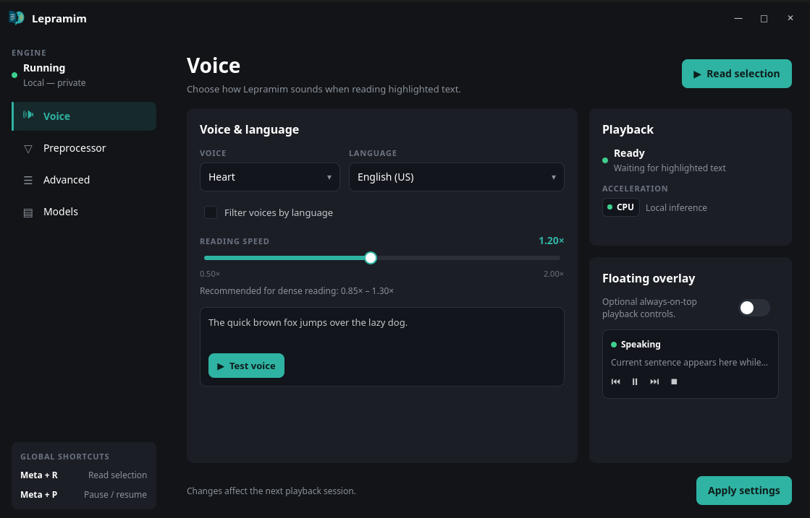

<p align="center">
  
</p>

<h1 align="center">Lepramim</h1>

<p align="center">
  <strong>Listen to anything you can highlight.</strong><br />
  Select text. Press Meta+R. Hear it in a natural neural voice.<br />
  Local text-to-speech for Linux — no accounts, no cloud, no telemetry.
</p>

<p align="center">
  <a href="https://github.com/jmarceno/lepramim/releases">Get Lepramim</a> ·
  <a href="#why-lepramim">Why Lepramim</a> ·
  <a href="#quick-start">Quick start</a> ·
  <a href="#everyday-use">Everyday use</a> ·
  <a href="#voices-and-languages">Voices</a> ·
  <a href="#troubleshooting">Help</a>
</p>

<p align="center">
  <a href="LICENSE"></a>
  
  
</p>

<p align="center">
  
</p>

---

## Why Lepramim

Turn a long article into a listening session, work through a paper, or hear
your own writing back. Lepramim reads the selection from the app you're
already using: a PDF reader, browser, editor, or anywhere you can highlight text.

| What you want | What Lepramim gives you |
| --- | --- |
| **Listen without switching apps** | One shortcut to speak the selection, another to pause or resume. |
| **Keep your text private** | Kokoro-82M generates speech on your hardware. After the one-time model download, reading works offline. |
| **Make dense text easier to hear** | Optional cleanup removes citations and Markdown, expands abbreviations, and reads numbers and math symbols as words. |
| **Find a voice that fits** | 54 voices, 9 language options, and playback speed from 0.50× to 2.00×. |
| **Keep controls close** | A tray icon shows engine status; an optional floating overlay puts pause, sentence navigation, and stop over any window. |
| **Start listening quickly** | One portable executable, models downloaded from the app, and optional startup at login. |

## Quick start

1. Download the latest `Lepramim-*-x86_64-portable.run` from
   [Releases](https://github.com/jmarceno/lepramim/releases).
2. Make it executable and run it:

   ```bash
   chmod +x Lepramim-*-x86_64-portable.run
   ./Lepramim-*-x86_64-portable.run
   ```

3. On first launch, a welcome window downloads the speech models (~340 MB) with a
   progress bar. You can **Continue** (the download runs in the background and
   Lepramim becomes available as soon as it finishes) or **Skip** and download
   later from the **Models** tab.

4. Highlight a sentence in another app and press **Meta+R** on KDE Plasma.
   On other desktops, [bind your preferred shortcuts](#hotkeys) first.
   Use **Meta+P** to pause or continue.

That's the whole install — no system services, no configuration files to edit.
Downloads are verified by checksum, and models are kept between app updates.

Opening Lepramim a second time never starts a duplicate: the running copy just
brings its control window forward.

## Everyday use

- **Listen:** highlight text anywhere, then press **Meta+R** (or right-click
  the tray icon and choose **Speak highlighted selection**).
  On Wayland, Lepramim briefly presses Ctrl+C for you to capture the highlight;
  your existing clipboard content is never spoken by mistake — before-and-after
  clipboard snapshots are compared. If nothing is highlighted, a notification
  tells you to select text first.
- **Pause / resume:** **Meta+P**, the tray menu, or the floating overlay.
- **Stop:** the tray menu or the overlay's stop button.
- **Tray at a glance:** dim blue means stopped, breathing blue means warming
  up, solid green means speaking (it stays green while paused so you know
  where you left off).
- **Change how it sounds:** open the control window from the tray to pick a
  voice and language, adjust speed, audition voices with **Test voice**, and
  toggle the preprocessor cleanup options.

### Optional: floating overlay

An always-on-top bar shows the current sentence with previous, pause, next,
and stop buttons. It is off by default to keep Lepramim discreet; turn it on
in the control window.

## Hotkeys

| Shortcut | Action |
|----------|--------|
| **Meta+R** | Speak highlighted selection |
| **Meta+P** | Pause / resume playback |

On KDE Plasma the shortcuts are registered system-wide and work everywhere.
On other desktops, Lepramim exposes an `org.lepramim.App` service on the
session bus (`SpeakSelection` / `Toggle`) so you can bind keys of your choice
in your keyboard settings.

**Wayland note:** capturing a highlight with one keypress needs one of
`ydotool`, `wtype`, `xdotool`, or `dotool` on your system (the portable file bundles
`xclip`/`wl-clipboard` for the clipboard itself). Without a key-injection
tool, just copy the text yourself (Ctrl+C) and press **Meta+R** — Lepramim
reads the clipboard content.

## Voices and languages

Choose a voice in the control window, adjust the speed, and use **Test voice**
to hear a sample before reading. The bundled catalog covers:

| Language option | Voices |
| --- | ---: |
| English (American) | 20 |
| English (British) | 8 |
| Spanish | 3 |
| French | 1 |
| Hindi | 4 |
| Italian | 2 |
| Japanese | 5 |
| Portuguese (Brazilian) | 3 |
| Chinese (Mandarin) | 8 |

See the [full voice catalog and model details](docs/models.md) for voice IDs,
download locations, and model licensing.

## Requirements

- A Linux desktop with a system-tray host (StatusNotifier). The app refuses to
  start without one and tells you so.
- A graphical session (X11 or Wayland).
- The x86_64 portable release targets glibc 2.35 or newer.

Qt, audio libraries, and clipboard helpers are bundled in the portable file.
On Wayland, automatic selection capture also needs a
[key-injection tool](#hotkeys); copying the text yourself works without one.

## Troubleshooting

- **No tray icon:** your desktop has no StatusNotifier host running. Start one
  (e.g. Plasma's system tray, GNOME's AppIndicator/KStatusNotifierItem extension, or your bar's StatusNotifier module) and
  relaunch.
- **Meta+R does nothing:** on KDE, check that no other action grabbed Meta+R.
  Elsewhere, bind your preferred keys to the `org.lepramim.App` bus service in
  keyboard settings. On Wayland without a key-injection tool, copy first.
- **“Select text first” notification:** nothing was highlighted and the
  clipboard held no new text. Highlight (or copy) some text and try again.
- **No sound:** check your system volume and output device, then stop and
  restart the engine from the tray menu.
- **Speech never starts after an update:** open the **Models** tab in the
  control window. If a file shows missing, press **Download missing models**.
  If trouble persists, quit the app, delete `~/.cache/lepramim/models`, and
  relaunch — the welcome window will offer the download again.
- **Something else?** The engine log lives at
  `$XDG_RUNTIME_DIR/lepramim/daemon.log`; include the relevant lines when
  asking for help.

## Settings files

Lepramim works out of the box. Every setting is stored as plain text at
`~/.config/lepramim/config.toml`, and the control window edits it for you.
Speech models live in `~/.cache/lepramim/models/` — outside the app on
purpose, so reinstalling or updating Lepramim never re-downloads them.

## Licensing

- Lepramim is MIT-licensed — see [`LICENSE`](LICENSE).
- The Kokoro-82M model and voice pack downloaded by the app are Apache-2.0
  (details in [`docs/models.md`](docs/models.md)); Lepramim uses them unmodified.

## Building from source

If you want to build Lepramim yourself, see
[`docs/building.md`](docs/building.md) for system dependencies and the build,
package, and smoke-test commands.

Have an idea or found a bug? [Open an issue](https://github.com/jmarceno/lepramim/issues)
with your desktop environment and the relevant engine log. If Lepramim helps
you read more comfortably, a star helps others find it.
