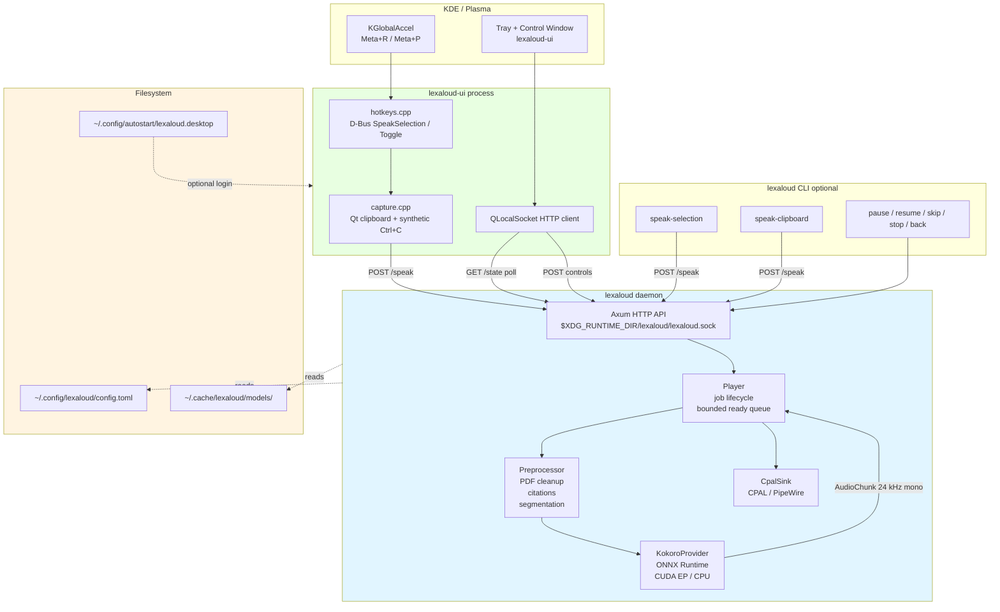

# Architecture

Lexaloud is two native processes loosely coupled by a Unix domain socket:

1. A **Rust daemon** (`lexaloud` binary, Tokio + Axum) that owns the TTS
   provider, the playback state machine, and the CPAL audio sink.
2. A **Qt 6 UI** (`lexaloud-ui` binary, C++/Qt) providing a tray indicator,
   control window, **in-process selection capture**, and **KGlobalAccel hotkeys**.
   It connects via `QLocalSocket`.
3. A **CLI** (`lexaloud` subcommands) for scripting and debugging. It captures
   selection text and sends HTTP requests to the daemon over the same socket.

The binding between them is intentionally thin so each piece can be tested or
replaced in isolation.

## Normal lifecycle (AppImage / desktop)

Double-clicking the AppImage (or `lexaloud app`) does **not** install a systemd
unit. The launcher:

1. Ensures models and config exist.
2. Spawns `lexaloud daemon` as a child (using the AppImage path while mounted).
3. Starts `lexaloud-ui` for the tray and hotkeys.
4. On tray quit, POSTs `/shutdown` to the daemon and waits for exit.

Optional **Start with desktop** writes an XDG autostart entry that re-runs the
AppImage at login. `lexaloud setup` can write the same entry; `lexaloud
uninstall` removes autostart and best-effort leftover files.

## Component diagram

## Data flow: Meta+R (tray hotkey)

1. User selects text and releases **Meta+R** (250 ms settle so Meta is up
   before synthetic Ctrl+C).
2. `HotkeyManager` receives `globalShortcutReleased` from KGlobalAccel and
   calls `speakCapturedSelection()`.
3. **Capture** (`ui/src/capture.cpp`):
   - **X11**: Qt `QClipboard::Selection`, then `xclip -o -selection primary`.
   - **Wayland**: skip PRIMARY (often stale or slow via `wl-paste`); read Qt
     clipboard, send synthetic Ctrl+C via `ydotool` / `wtype` / `xdotool` /
     `dotool`, then re-read clipboard. Prefer fresh clipboard over unchanged
     stale content when copy succeeds.
4. UI POSTs `{"text": ..., "mode": "replace"}` to `/speak` over the Unix socket.
5. Daemon preprocesses, enqueues sentences, synthesizes with Kokoro, and plays
   through CPAL.

The tray menu **Speak highlighted selection** uses the same in-process capture
path (not `startDetached(lexaloud speak-selection)`).

## Data flow: CLI `speak-selection`

1. User runs `lexaloud speak-selection` (daemon must already be running).
2. CLI tries PRIMARY (`wl-paste --primary` or `xclip`), then force-copy and
   clipboard / Klipper fallback (`src/platform/selection.rs`).
3. CLI POSTs to `/speak` as above.

## Playback pipeline

Kokoro emits **mono PCM at 24 kHz**. `CpalSink` (`src/audio.rs`):

- Opens the default output device once and keeps the stream open between jobs
  (reopening PipeWire per sentence added large latency).
- Resamples 24 kHz → device rate when they differ.
- Writes **one sample per frame**, duplicated to all output channels (stereo
  devices otherwise play ~2× too fast; combined with resampling bugs this
  previously sounded ~4× fast).
- Prefers opening the device at 24 kHz when the hardware supports it.

The player still streams at **sentence granularity**: producer synthesizes whole
sentences; consumer writes sub-chunk blocks with pause/cancel checks and inserts
a short silence pad between sentences.

## Key design choices

### Sentence granularity, not sample granularity

Streaming at the sentence level gives clean pause/skip/back semantics — Kokoro
emits a whole-sentence waveform per call. Sub-chunk playback allows ~100 ms
pause latency without touching the synthesis pipeline.

### Bounded ready queue

Bounded async channel (`ready_queue_depth = 3` by default) between producer and
consumer bounds memory. When the user pauses, the producer blocks on send after
the queue fills up.

### Cooperative cancellation via job IDs

The provider takes `(sentence, job_id, is_current_job)` and checks
`is_current_job(job_id)` at key points. On `stop`/`skip`/`back` we bump the job
ID; in-flight synthesis returns `None` after completion.

### Unix domain socket, not TCP loopback

The daemon binds `$XDG_RUNTIME_DIR/lexaloud/lexaloud.sock` inside a mode-0700
directory. Only the owner user's processes can reach it.

### ONNX Runtime with CUDA EP

The provider verifies execution providers after session construction and reports
`session_providers` in `/state`. Silent fallback to CPU is detected and surfaced
when CUDA was requested.

### Qt UI via QLocalSocket

`lexaloud-ui` polls `GET /state` and sends control POSTs over the same UDS. The
UI is a separate process so a UI crash does not take down the daemon; hotkeys
and capture stay in-process to avoid reloading ONNX on every keypress.

## What's NOT in the daemon

- **No audio mixing** — single producer, single sink; CPAL stream stays open while
  the daemon runs.
- **No session persistence** — `/state` is ephemeral across daemon restarts.
- **No remote control** — UDS only, no TCP listener.
- **No mandatory systemd** — normal use is AppImage / autostart; a legacy user
  unit file may still exist on some machines and is removed by `uninstall`.

## See also

- `docs/models.md` — Kokoro model provenance and voice list.
