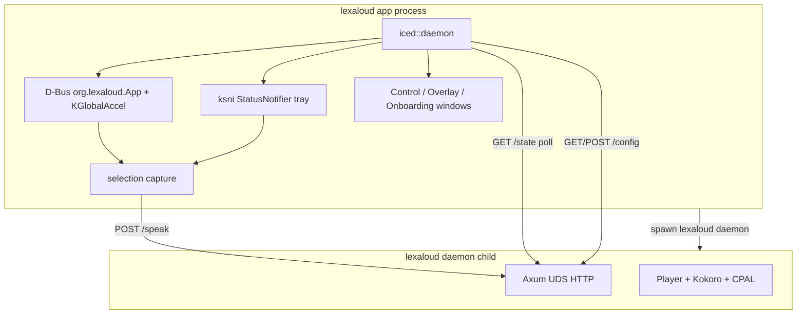

# Lexaloud architecture

Lexaloud is a **single Rust binary** with an in-process **Iced** desktop shell and a **child daemon** for speech synthesis.

## Processes

## Components

| Layer | Technology | Role |
|-------|------------|------|
| GUI | Iced 0.13 (tiny-skia) | Tray-first daemon; windows on demand |
| Tray | ksni (StatusNotifier) | Tray menu without GTK |
| Hotkeys | zbus + KGlobalAccel | Meta+R speak, Meta+P toggle |
| Capture | wl-paste / xclip / synthetic Ctrl+C | Unified Qt-algorithm port in `src/ui/capture.rs` |
| Daemon API | Axum over Unix socket | TTS, audio, MPRIS, config |
| Models | ureq + SHA-256 verify | Kokoro ONNX + voice bank download |

## Lifecycle

1. `lexaloud` / `lexaloud app` ensures config exists (not blocking on model download).
2. Iced starts tray + hotkeys; onboarding opens if artifacts are missing.
3. When models are ready, the app spawns `lexaloud daemon`.
4. Tray quit calls `POST /shutdown` and waits for the child.

## Configuration

The control window **GETs full config, merges edits, POSTs full config** so partial updates cannot wipe unrelated TOML sections.

## Packaging

- Native stage: `scripts/build-native.sh` (cargo only, one binary).
- AppImage: `scripts/build-appimage.sh` bundles ldd-discovered GUI/audio deps; **no Qt**.
