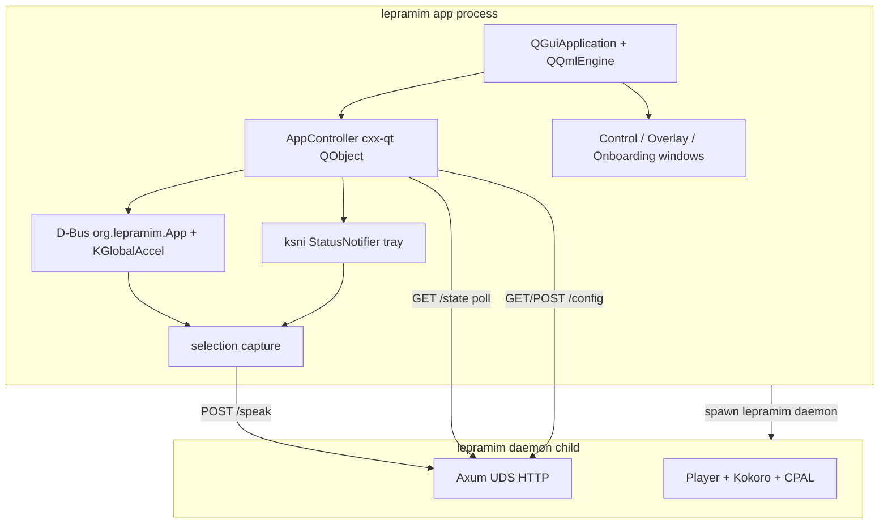

# Lepramim architecture

Lepramim is a **single Rust binary** with an in-process **Qt 6 QML** desktop
shell (via cxx-qt) and a **child daemon** for speech synthesis.

## Processes

## Components

| Layer | Technology | Role |
|-------|------------|------|
| GUI | Qt 6 QML + Quick Controls 2 (cxx-qt) | Tray-first app; windows on demand |
| Tray | ksni (StatusNotifier) | Tray menu without GTK |
| Hotkeys | zbus + KGlobalAccel | Meta+R speak, Meta+P toggle |
| Capture | wl-paste / xclip / synthetic Ctrl+C | Selection capture in `src/ui/capture.rs` |
| Daemon API | Axum over Unix socket | TTS, audio, MPRIS, config |
| Models | ureq + SHA-256 verify | Kokoro ONNX + voice bank download |

## Lifecycle

1. Opening the app ensures the config file exists (without waiting for models).
2. The app starts the tray icon and hotkeys; the welcome window opens if the
   speech models are missing.
3. When models are ready, the app spawns its speech-engine child process.
4. Quitting from the tray menu shuts the engine down and waits for it to exit.

## Configuration

The control window **GETs full config, merges edits, POSTs full config** so partial updates cannot wipe unrelated TOML sections.

## Packaging

- Native stage: `scripts/build-native.sh` (cargo + Qt 6, one binary).
- AppImage: `scripts/build-appimage.sh` bundles Qt QML plugins via linuxdeploy-plugin-qt plus ldd-discovered audio deps.
